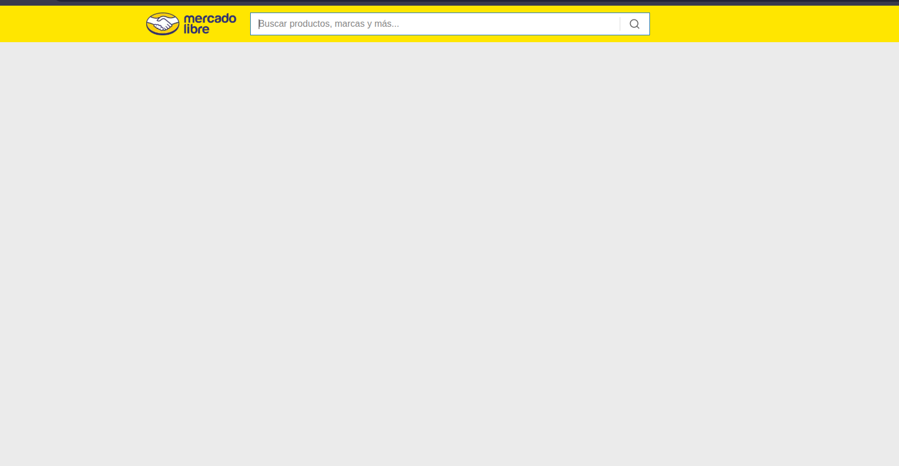
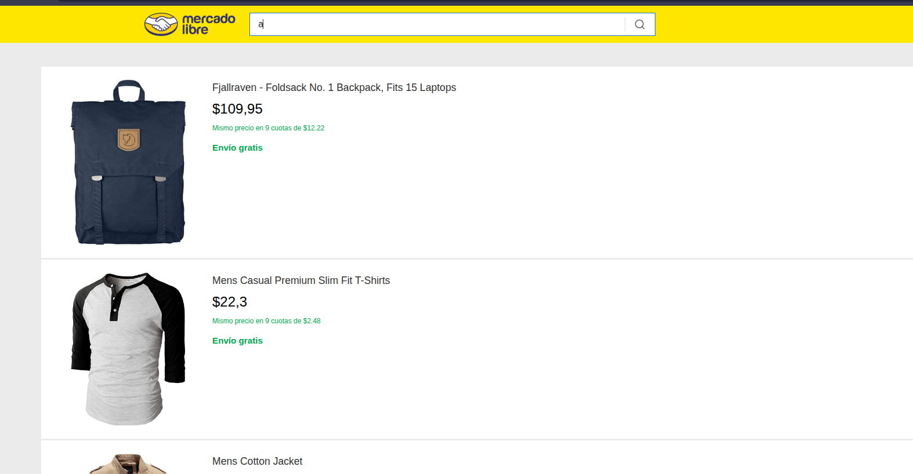
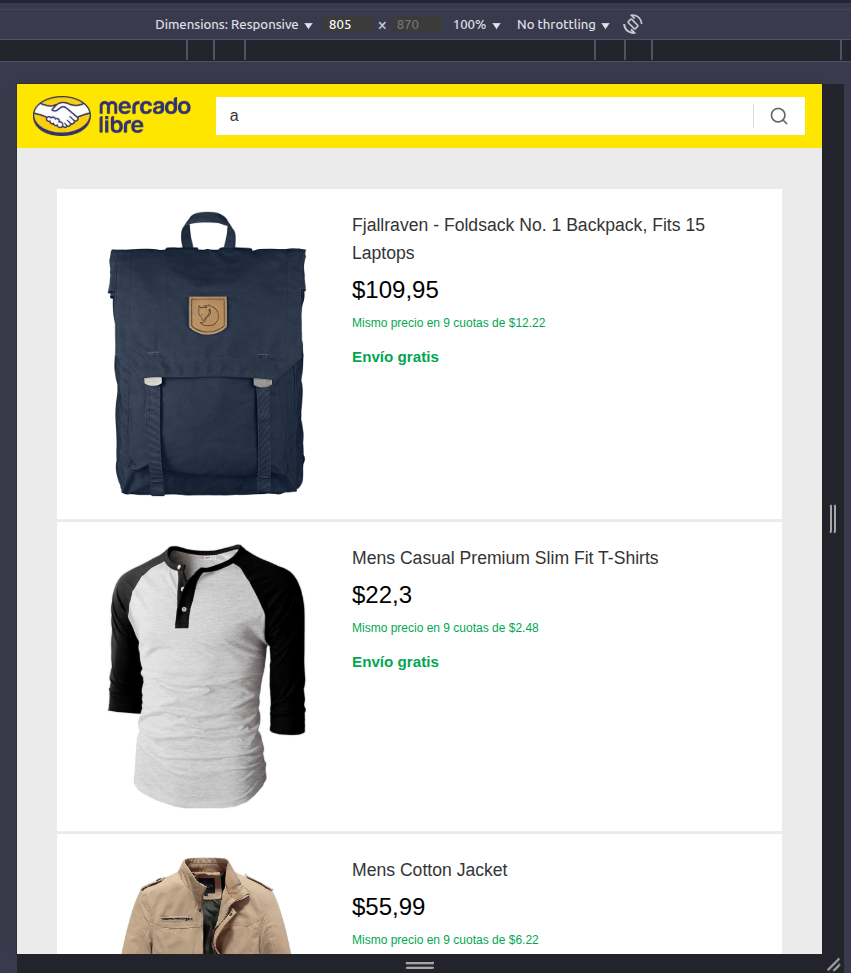
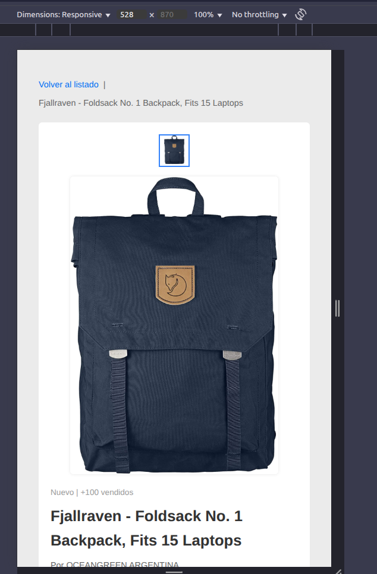
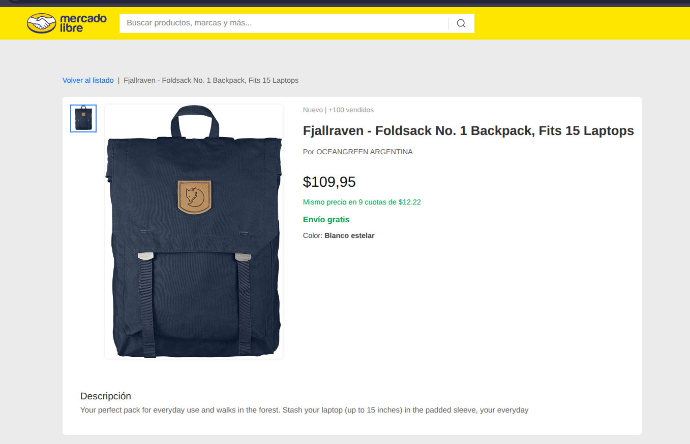

# Meli Shop

# Getting Started with React, TypeScript, SSR y Express.

## Features

- SSR with React and Express
- Product search and pagination
- Product details
- Modern and responsive styles (Sass)
- Docker-ready
- TypeScript-based code

## Demo

---

## Instalación

1. Clone the repository:

git clone https://github.com/nathsep9/meli-shop.git

cd meli-shop

2. Install dependencies:

npm install

3. Environment Variables:

Create a .env file in the root

API_URL=http://localhost:3000

PORT=3000

FAKESTORE_API=https://fakestoreapi.com/products

4. Available Scripts

npm run build

npm start

5. Run docker

docker build -t meli-shop .

docker run -p 3000:3000 --env-file .env meli-shop